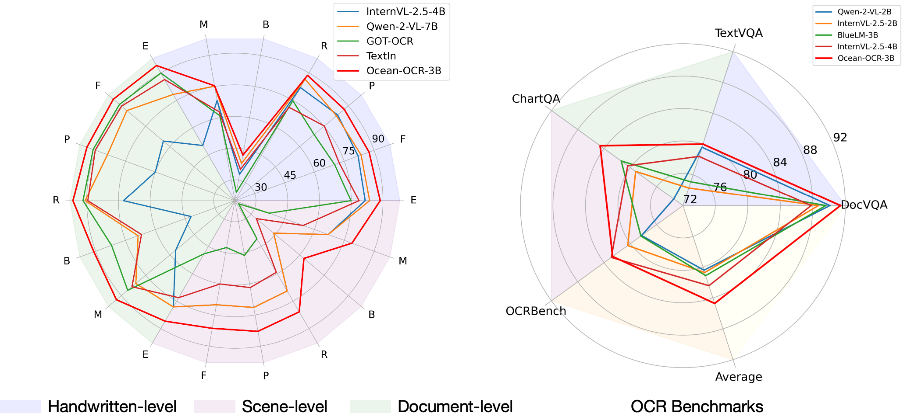

<h2 align="center">Ocean-OCR</a></h2>

## 1. Introduction
Multimodal large language models (MLLMs) have shown impressive capabilities across various domains, excelling in processing and understanding information from multiple modalities. Despite the rapid progress made previously, insufficient OCR ability hinders MLLMs from excelling in text-related tasks. In this paper, we present \textbf{Ocean-OCR}, a 3B MLLM with state-of-the-art performance on various OCR scenarios and comparable understanding ability on general tasks. We employ Native Resolution ViT to enable variable resolution input and utilize a substantial collection of high-quality OCR datasets to enhance the model performance.

## 2. OCR practical scenarios
